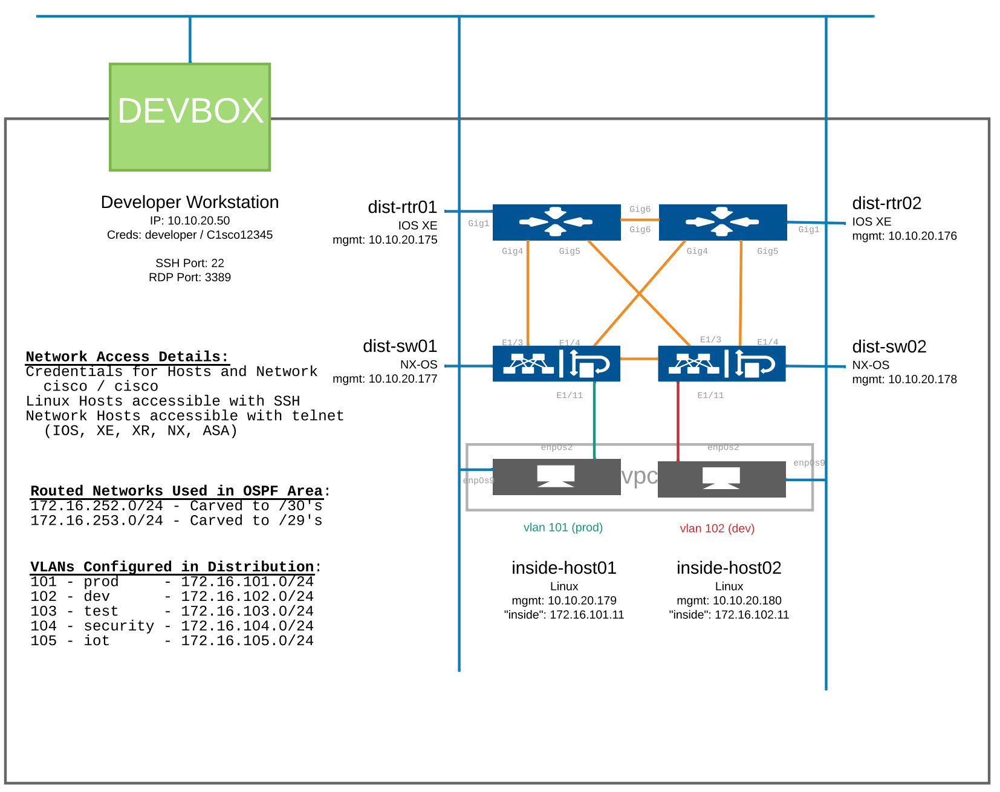

# Ansible Network Demos

## Overview

This repository is intended to provide demos for Ansible network devices within the Cisco DevNet 
Sandbox. These are intended to illustrate common functionality available within the ansible 
ecosystem specific to network equipment. 

The repository is broken up into Basic, Intermediary, and Advanced subdirectories with each one 
having their own unique instructions and playbooks. All subsections will use the same method of 
connectivity listed below.

- **Basic** 
    - RAW Ansible module usage
    - Simple inventory
    - Simple playbooks
        - Variables
        - ios_command or ios_config modules
- **Intermediary**
    - Structured static inventory files
    - Mature playbooks
        - Loops
        - Reuse variables
        - ios_command, ios_config & specific function modules
- **Advanced (FUTURE)**
    - Dynamic inventory
    - Complex playbooks
        - Chaining multiple plays
        - Advancing functionality using RAW python

## Connectivity

All labs are intended to be used with the Cisco DevNet Sandbox lab titled 
Cisco Modeling Labs (CML): Enterprise v2.2.2. These labs change periodically change and as a result the 
instructions may need to be modified according to new scenarios.  The Cisco DevNet Sandbox gives 
a consistent user experience to these lab features regardless of the users available environment.  It provides 
a common topology using both IOS-XE and NX-OS devices.  

All devices in the sandbox can be accessed with either SSH or Telnet.  

NOTE: Ansible requires SSH for connectivity which is enabled by default on all of the IOS-XE and NX-OS devices.  

### Topology
The topology for the lab consist of 4 network devices, 2 IOS-XE and 2 NX-OS devices.  Two additional hosts are available 
connected to each local network segment and a DevBox which is used for programmatic interaction with the devices.  
 


#### Cisco DevNet Sandbox

Cisco DevNet Sandboxes can be accessed at the following URL:
[https://developer.cisco.com/sandbox](https://developer.cisco.com/sandbox)

- Locate the sandbox labeled: Cisco Modeling Labs Enterprise (Version 2.2.2 as of this update).
- Reserve lab (Recommend minimum of 4 hours.  Can be extended for up to 2 days)
- Wait for email instructions to login (takes 10-15 minutes)
- Login via Cisco AnyConnect VPN using instruction provided in the email
    - If you do not have AnyConnect, click on the **VPN Access** tab to download
- Access DevBox @ 10.10.20.50
- Review other device access on the **Network Devices** tab

NOTE: Only one active lab allowed at a time.  If lab does not load properly, in the sandbox UI you can choose to 'End Session' which will terminate connectivity and 
teardown devices.  Once torn down you can reschedule another session.

Optionally you may use a local machine capable of running Ansible (Linux systems, Mac, or Windows Subsystem for Linux).  
If you choose to do this make sure you have met the following requirements:

- Ansible v2.9+
- Python v3.8+
- Ansible-galaxy collections
    - ansible.network
    - cisco.ios
    - cisco.nxos

Once logged in you may continue with the lab.


### DevBox interaction

The sandbox provides us with the DebBox which is used for programmatic interaction with the network devices.  As of this 
writing, the DevBox is running CentOs with Python 3.6.8 and Ansible 2.9.  Login details via SSH for the DevBox are
 listed below.  

### Accessing DevBox
| Login via SSH ||
| ----------- | ----------- |
| **IP Address** | 10.10.20.50 |
| **Username** | developer |
| **Password** | C1sco12345 |


### First Use
Login using the IP and credentials above.  Once you are logged into the DevBox you should be placed into a Python Virtual Environment in the shell. 
```
(py3venv) [developer@devbox ~]$ ssh developer@10.10.20.50
Warning: Permanently added '10.10.20.50' (ECDSA) to the list of known hosts.
developer@10.10.20.50's password:
Last Login: Mon Aug 7 08:07:22 2022 from 192.168.254.11
(py3venv) [developer@devbox ~]$
```

Although the DevBox has Python v3.x on it, this instance is pointed to Python 2.7.5 instance.  This can be verified using 
the ```ansible --version``` command.  This will list both the ansible and python versions as well as the location of any 
configuration or executable files being used.  Hopefully this gets fixed soon but if python version < 3.x you will need 
to upgrade in order for this to work properly.  

The easiest way to upgrade is to install Ansible using pip3 in the virutal environemnt.

```
pip3 install ansible
``` 
Once ansible has been installed again, logout and back into the session.  Run the command ```ansible --version``` again 
and you should see the verison updated to at least 3.6.8.  

```
(py3venv) [developer@devbox ~]$ ansible --version
ansible 2.10.7
  config file = None
  configured module search path = ['/home/developer/.ansible/plugins/modules', '/usr/share/ansible/plugins/modules']
  ansible python module location = /home/developer/py3venv/lib/python3.6/site-packages/ansible
  executable location = /home/developer/py3venv/bin/ansible
  python version = 3.6.8 (default, Sep 14 2019, 14:33:46) [GCC 4.8.5 20150623 (Red Hat 4.8.5-36)]
(py3venv) [developer@devbox ~]$ 
```

## Clone Repository

Clone this repository from the command line in the home directory of the DevBox using ```git```.

```
git clone https://github.com/InsightSSG/netdevops-ansible-demos.git
```

This command will reach out to github and copy the main branch of this repository to a local directory called 
*netdevops-ansible-demos*.  Once downloaded, ```cd netdevops-ansible-demos``` to continue.

## Sub-section catalog

- Basic
- Intermediary
- Advanced

